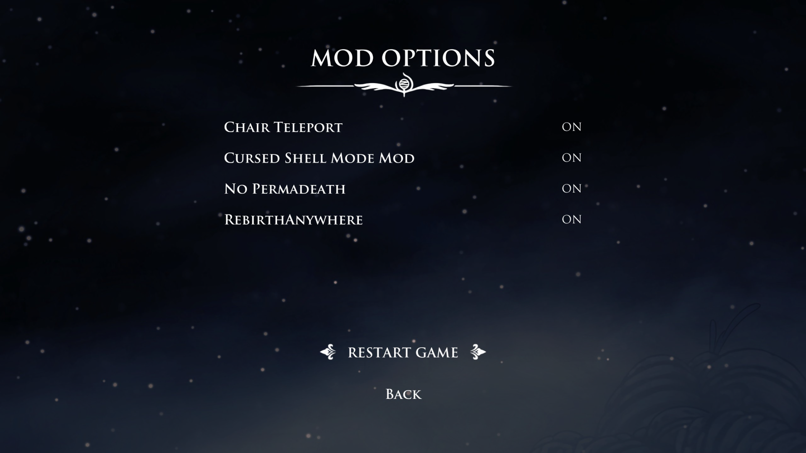
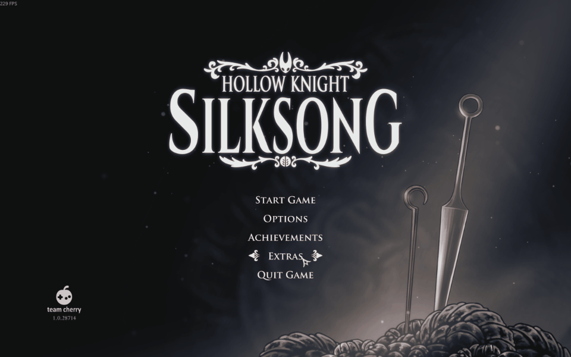

Place all three files in ...\Hollow Knight Silksong\BepInEx\plugins, then you can configure all your mods in Extras - Mod Options
将所有三个文件放在...\Hollow Knight Silksong\BepInEx\plugins中，你就可以在Extras - Mod Options内来调整所有的mod
